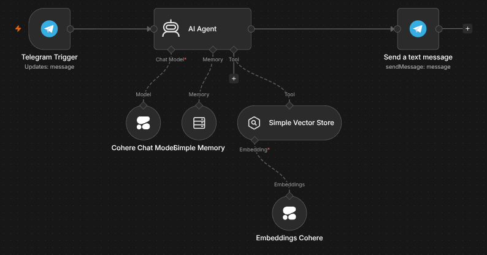
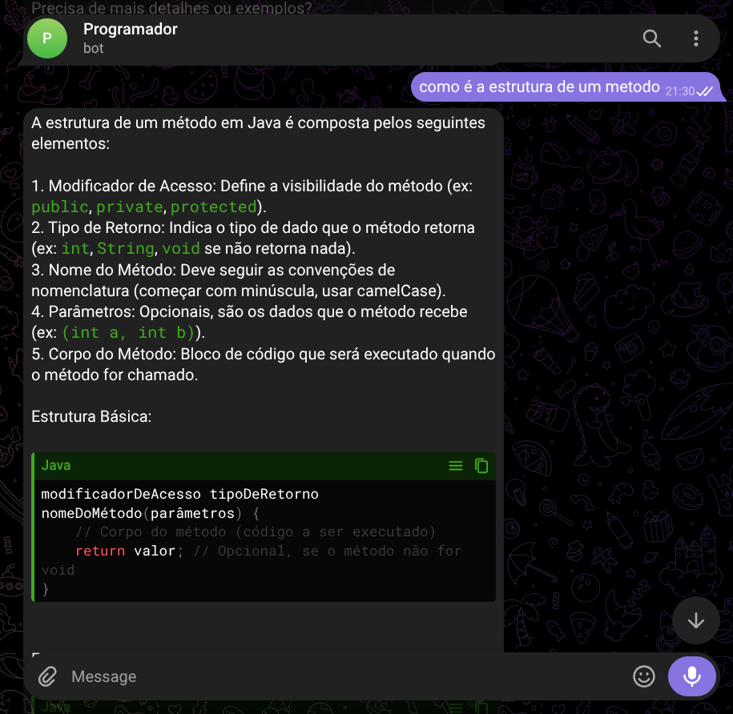

# 🤖 Agente de IA com N8N e Telegram

Este projeto consiste em um agente de Inteligência Artificial desenvolvido utilizando N8N, Cohere e Telegram. O objetivo é permitir que usuários façam perguntas em linguagem natural e recebam respostas inteligentes baseadas em uma base de conhecimento previamente carregada.

## 📋 Sobre o Projeto

O agente utiliza uma requisição http para acessar um pdf que contem informação da linguagem de programação Java, a qual ele utiliza para dar respostas.

Com isso, ele pode ser utilizado para tirar duvidas dessa linguagem de PRogramação

## 🚀 Funcionalidades

- Recebimento de mensagens pelo Telegram.
- Consulta a documentos armazenados.
- Busca semântica utilizando Vector Store.
- Geração de respostas por Inteligência Artificial.
- Fluxo totalmente automatizado no N8N.

## 🛠 Tecnologias Utilizadas

- N8N
- Telegram Bot API
- CoHere
- GitHub

## 🔄 Fluxo de Funcionamento

A imagem abaixo mostra o fluxo responsável por receber a mensagem do usuário, processar a consulta e retornar a resposta.



## 📱 Bot em Funcionamento

Exemplo do agente respondendo perguntas diretamente pelo Telegram.



## 📂 Estrutura do Projeto

```text
Agente_de_IA/
│
├── Java-Basico-Guia.pdf
├── images/
│   ├── fluxo.png
│   └── bot-funcionando.png
│
└── README.md
```

## 🎯 Exemplos de Perguntas

- O que é orientação a objetos?
- Explique encapsulamento.
- Como criar uma variável em Java?
- O que é herança?
- Crie um exemplo simples de classe em Java.

## 📈 Objetivo

Este projeto foi desenvolvido para aplicar os conhecimentos que adquiri na Imersão : Agente de IA, feito pela Alura e Oracle Next Education

## 👨‍💻 Autor

Marcos Junio